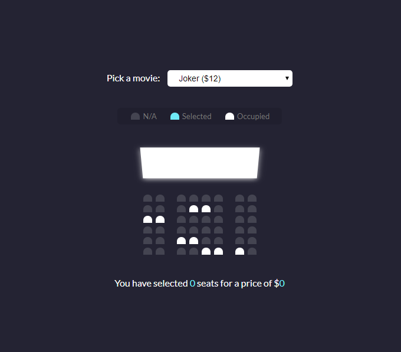

# Movie Seat Booking
 Display movie choices and seats in a theater to select from in order to purchase tickets
 
 ## Project Specifications

- Display UI with movie select, screen, seats, legend & seat info
- User can select a movie/price
- User can select/deselect seats
- User can not select occupied seats
- Number of seats and price will update
- Save seats, movie and price to local storage so that UI is still populated on refresh
 
## Steps to execute:
- Download the entire code 
- Open up the index.html.
- [View Live Site](https://anthonys1760.github.io/Movie-Seat-Booking-App/)

## Technologies used: 
- HTML
- CSS
- Javascript
